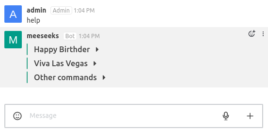
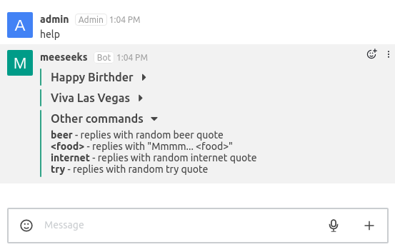

Hubot Help Plugin
==================

[](https://travis-ci.org/hubotio/hubot-help) [](https://coveralls.io/github/hubotio/hubot-help?branch=master)

A hubot script to show available hubot commands

See [`src/help.js`](src/help.js) for full documentation.

Features
-----------------

Allows grouping commands by name of script they belong to. 

For grouping commands, frame list of them by markers `begin group script_name` and `end group`. All commands out of markers go to the `Other command` group. 

```
//
// Commands:
//   begin group script_name
//    hubot command - command description
//    ...
//   end group
//
```

Example result:

<p align="left">
    
</p>
<p align="left">
    
</p>

Check the [hubot-happy-birthder](https://github.com/tolstoyevsky/hubot-happy-birthder/blob/master/src/birthder.js) and [hubot-viva-las-vegas](https://github.com/tolstoyevsky/hubot-viva-las-vegas/blob/master/src/viva.js) repos for exapmle usage.

Installation
-----------------

In hubot project repo, run:

`npm install hubot-help --save`

Then add **hubot-help** to your `external-scripts.json`:

```json
["hubot-help"]
```

Configuration
-----------------

You can set various environment variables to tune up the behavior of thios help plugin:

- `HUBOT_HELP_REPLY_IN_PRIVATE` (set to any value) will force calls to `hubot help` to be answered in private
- `HUBOT_HELP_DISABLE_HTTP` (set to any value) will disable the web interface for help
- `HUBOT_HELP_HIDDEN_COMMANDS` comma-separated list of commands that will not be displayed in help

Development
-----------------

For tests:

    npm test


Sample Interaction
-----------------

```
 user> hubot help
hubot> hubot help - Displays all of the help commands that this bot knows about.
hubot> hubot help <query> - Displays all help commands that match <query>.
```
