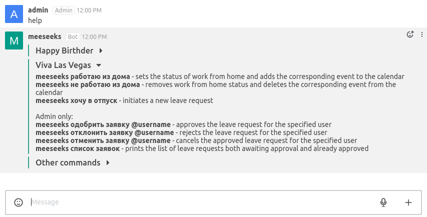
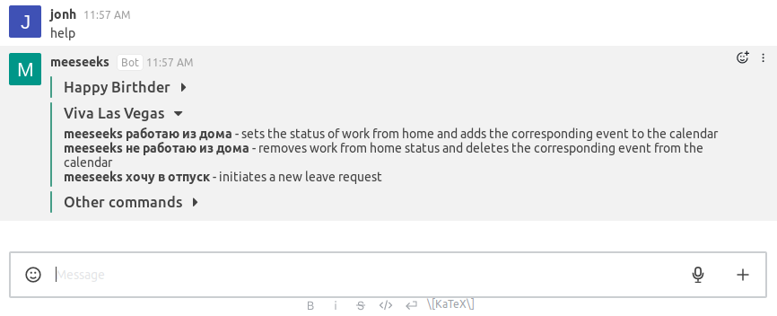

# Hubot Help Plugin

[](https://travis-ci.org/hubotio/hubot-help) [](https://coveralls.io/github/hubotio/hubot-help?branch=master)

A hubot script to show available hubot commands

See [`src/help.js`](src/help.js) for full documentation.

## Features

* Allows grouping commands by the name of the script they belong to.

    To group commands, surround them with the markers `begin group script_name` and `end group`. All the commands behind the markers go to the `Other commands` group.

```
//
// Commands:
//   begin group script_name
//    hubot command - command description
//    ...
//   end group
//
```

Example result:

<p align="left">
    
</p>
<p align="left">
    
</p>

* Allows marking commands as `admin only` and showing only avalible commands to users.

    To use this feature, surround the commands with the markers `begin admin` and `end admin`. The commands inside the markers will be shown only to admin users.

```
//
// Commands:
//   begin group script_name
//    hubot command - command avalible for all users
//    ...
//      begin admin
//        hubot command - command avalible only for admins
//        ...
//      end admin
//   end group
//
```

For example:

<p align="left">
    
</p>
<p align="left">
    
</p>

Check the [hubot-happy-birthder](https://github.com/tolstoyevsky/hubot-happy-birthder/blob/master/src/birthder.js) and [hubot-viva-las-vegas](https://github.com/tolstoyevsky/hubot-viva-las-vegas/blob/master/src/viva.js) repos for exapmle usage.

## Installation

In hubot project repo, run:

`npm install hubot-help --save`

Then add **hubot-help** to your `external-scripts.json`:

```json
["hubot-help"]
```

## Configuration

You can set various environment variables to tune up the behavior of the help script:

- `HUBOT_HELP_REPLY_IN_PRIVATE` (set to any value) will force calls to `hubot help` to be answered in private
- `HUBOT_HELP_DISABLE_HTTP` (set to any value) will disable the web interface for help
- `HUBOT_HELP_HIDDEN_COMMANDS` comma-separated list of commands that will not be displayed in help

## Development

For tests:

    npm test


## Sample Interaction

```
 user> hubot help
hubot> hubot help - Displays all of the help commands that this bot knows about.
hubot> hubot help <query> - Displays all help commands that match <query>.
```

## Licensing

hubot-help is available under the [MIT License](LICENSE).
